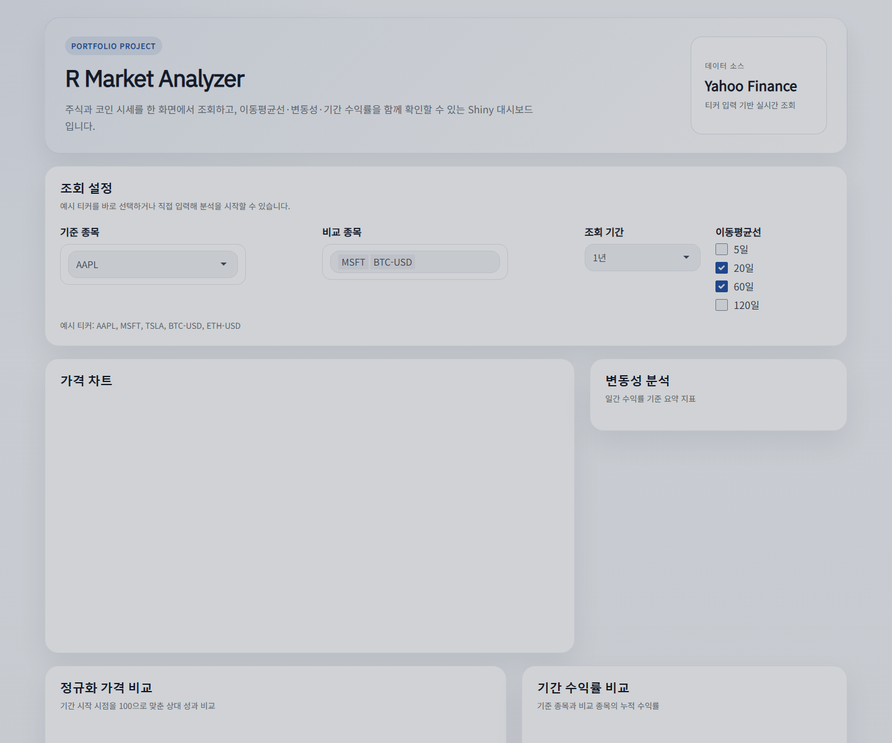

# r-market-analyzer

## 1. 한 줄 소개

한 화면에서 주식과 코인 시세를 조회하고, 이동평균선·변동성·기간 수익률을 비교할 수 있는 R Shiny 기반 금융 분석 대시보드입니다.

## 2. 프로젝트 개요

`r-market-analyzer`는 주식과 가상자산 티커를 입력해 시장 데이터를 불러오고, 핵심 기술적 지표와 수익률을 빠르게 확인할 수 있도록 만든 포트폴리오용 프로젝트입니다.  
사용자는 기준 종목과 비교 종목을 선택해 가격 흐름을 살펴보고, 이동평균선과 변동성 요약, 기간 수익률 비교를 한 번에 확인할 수 있습니다.

이 프로젝트는 다음과 같은 목적을 중심에 두고 설계했습니다.

- 금융 데이터 조회부터 시각화, 요약 분석까지 하나의 앱에서 자연스럽게 이어지도록 구성
- 포트폴리오 제출용으로 읽기 쉬운 구조와 방어적 예외 처리를 함께 고려
- R의 데이터 분석 역량과 Shiny의 인터랙티브 UI 장점을 동시에 보여줄 수 있도록 구현

## 3. 주요 기능

- 티커 입력 또는 예시 티커 선택 지원
- 조회 기간 선택 지원
  - 1개월
  - 3개월
  - 6개월
  - 1년
  - 3년
  - 전체
- 기준 종목과 비교 종목 다중 비교 지원
- 종가 기반 시계열 가격 차트 제공
- 이동평균선 5일, 20일, 60일, 120일 동시 표시 가능
- 일간 수익률 기반 변동성 분석 카드 제공
- 기간 수익률 비교 차트 및 테이블 제공
- 정규화 가격 비교 차트 제공
- 잘못된 티커 또는 데이터 부족 상황에 대한 사용자 친화적 메시지 제공

## 4. 기술 스택

- R
- Shiny
- tidyverse 계열 패키지
  - `dplyr`
  - `purrr`
  - `tidyr`
  - `tibble`
- `quantmod`
- `TTR`
- `ggplot2`
- `bslib`
- `DT`
- `scales`

### 왜 R과 Shiny를 선택했는가

R은 시계열 데이터 처리와 통계 요약, 시각화에 강점이 있고, Shiny는 분석 결과를 웹 애플리케이션 형태로 빠르게 전달하는 데 적합합니다.  
특히 금융 데이터처럼 반복적으로 기간을 바꾸고 종목을 비교해 보는 작업에서는, 정적인 리포트보다 인터랙티브 대시보드가 훨씬 높은 설명력을 제공합니다.

## 5. 화면 구성 설명

### 상단 헤더 영역

- 프로젝트 제목과 앱 소개 문구를 배치
- 데이터 소스 정보를 함께 표시

### 조회 설정 패널

- 기준 종목 티커 입력/선택
- 비교 종목 선택
- 기간 선택
- 이동평균선 표시 옵션 선택

### 가격 차트 패널

- 기준 종목의 종가 시계열 차트 표시
- 선택한 이동평균선을 함께 오버레이

### 변동성 분석 패널

- 일간 변동성
- 연환산 변동성
- 평균 일간 수익률
- 최대 상승일
- 최대 하락일

### 비교 분석 영역

- 정규화 가격 비교 차트
- 기간 수익률 막대 차트
- 기간 수익률 테이블

## 6. 분석 기능 설명

### 가격 차트

기준 종목의 종가를 시계열 라인 차트로 제공합니다.  
필요한 경우 비교 종목은 별도 정규화 비교 차트에서 확인하고, 메인 차트는 기준 종목을 중심으로 해석할 수 있도록 구성했습니다.

### 이동평균선

다음 이동평균선을 체크박스로 선택해 동시에 겹쳐 볼 수 있습니다.

- 5일
- 20일
- 60일
- 120일

단기와 중장기 추세를 한 번에 비교할 수 있어, 가격 흐름의 방향성과 괴리 정도를 쉽게 확인할 수 있습니다.

### 변동성 분석

일간 수익률을 기준으로 다음 항목을 계산합니다.

- 일간 변동성
- 연환산 변동성
- 평균 일간 수익률
- 최대 상승일
- 최대 하락일

단순 가격 수준이 아니라, 해당 종목이 얼마나 크게 흔들리는지까지 확인할 수 있도록 설계했습니다.

### 기간별 수익률 비교

기준 종목과 비교 종목들의 조회 기간 누적 수익률을 비교합니다.

- 막대 차트로 종목별 성과 비교
- 테이블로 시작일, 종료일, 시작가, 종료가, 수익률 요약
- 정규화 가격 차트로 상대 성과 추세 확인

## 7. 실행 방법

### 1) R 패키지 설치

아래 명령으로 필수 패키지를 설치할 수 있습니다.

```r
source("scripts/install_packages.R")
```

설치 스크립트는 기본 라이브러리에 쓰기 권한이 없을 경우 사용자 라이브러리(`R_LIBS_USER`)로 자동 설치하도록 처리했습니다.

또는 직접 설치해도 됩니다.

```r
install.packages(
  c("shiny", "bslib", "dplyr", "purrr", "tidyr", "tibble", "ggplot2", "quantmod", "TTR", "scales", "DT"),
  repos = "https://cloud.r-project.org"
)
```

### 2) 앱 실행

프로젝트 루트에서 아래 명령으로 바로 실행할 수 있습니다.

```r
shiny::runApp()
```

또는 RStudio에서 `app.R`를 열어 실행해도 됩니다.

### 3) 스모크 테스트 실행

간단한 실행 검증은 아래 명령으로 수행할 수 있습니다.

```r
source("scripts/smoke_test.R")
```

## 8. 예시 티커

- `AAPL`
- `MSFT`
- `TSLA`
- `NVDA`
- `BTC-USD`
- `ETH-USD`

## 9. 프로젝트 구조

```text
r-market-analyzer/
├─ app.R
├─ README.md
├─ .gitignore
├─ R/
│  ├─ data_fetch.R
│  ├─ indicators.R
│  ├─ volatility.R
│  ├─ returns.R
│  └─ ui_helpers.R
├─ scripts/
│  ├─ install_packages.R
│  └─ smoke_test.R
├─ www/
│  └─ styles.css
└─ docs/
   └─ screenshots/
```

## 10. 구현 포인트 / 설계 포인트

- 메인 앱 파일과 분석 함수 파일을 분리해 학습용으로 읽기 쉬운 구조 유지
- 데이터 조회 실패 시 앱 전체가 중단되지 않도록 방어적으로 처리
- 기준 종목은 반드시 성공해야 분석을 진행하고, 비교 종목 실패는 경고 메시지와 함께 부분 분석 허용
- 카드형 UI와 여백, 타이포그래피를 조정해 장난감처럼 보이지 않도록 구성
- 정규화 가격 차트와 수익률 막대 차트를 함께 배치해 절대 가격과 상대 성과를 분리해서 해석 가능

## 11. 금융 데이터 분석 프로젝트로서의 학습 포인트

- 외부 시세 데이터 수집과 예외 처리
- 시계열 데이터 전처리와 이동평균선 계산
- 일간 수익률 계산과 변동성 요약
- 복수 자산 비교를 위한 정규화 시계열 구성
- 분석 로직과 UI 로직을 분리하는 Shiny 프로젝트 구조 설계

## 12. 한계 및 개선 아이디어

현재 버전은 포트폴리오용 완성도와 핵심 기능 안정성에 집중했습니다.  
향후에는 아래 기능으로 확장할 수 있습니다.

- RSI, MACD 같은 보조지표 추가
- 포트폴리오 백테스트 기능
- 종목 즐겨찾기 저장
- DB 저장 및 이력 관리
- 사용자별 대시보드 커스터마이징
- 알림 기능 또는 정기 리포트 생성

추가로 Yahoo Finance 데이터 소스 특성상 일시적으로 응답이 실패하거나 일부 자산의 메타데이터가 불안정할 수 있습니다.  
실무 환경에서는 데이터 공급원 이중화, 캐싱, 사용자 설정 저장 기능을 함께 고려하는 것이 좋습니다.

## 13. 스크린샷 섹션

추후 아래 위치에 스크린샷을 추가할 수 있습니다.

- `docs/screenshots/dashboard-overview.png`
- `docs/screenshots/comparison-view.png`

예시 마크다운:

```md


```
